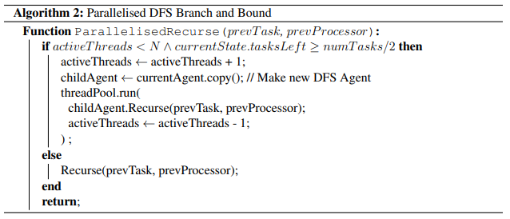

# Algorithm

Finding an optimal schedule is a NP-hard problem. The application requires an algorithm that can efficiently search through an exponential state space tree.

## Algorithms Characteristics

### A-Star
A-Star is an algorithm that searches the state tree. The algorithm explores the node with the best heuristic value, and stores visited states. 

**Advantages**: Does not explore past the optimal solution.  
**Disadvantages**: Exponential memory usage.

### DFS Branch and Bound
DFS Branch and Bound uses DFS to explore the search tree. However, once an optimal solution of cost k is found, the DFS will no longer explore in any nodes with cost >= k.

**Advantages**: Linear memory.  
**Disadvantages**: Can explore very deep into the tree before finding some solution.

### Iterative Deepening A-Star
Iterative Deepening A-Star is similar to DFS Branch and Bound, but the bound is explicitly defined. The bound begins at cost 0, and increments. Once a solution can be found with bound k, that must be the optimal solution, since there is no solution with bound < k.

**Advantages**: Does not explore past the optimal solution, linear memory.  
**Disadvantages**: Re-visits early nodes multiple times.

### Algorithm Choice
The application will use DFS Branch and Bound (DFSBB) for its linear memory usage.

## Pruning
Due to the exponential size of the search space, if the algorithm is able to recognise that some subtree will not produce an optimal solution, it should terminate immediately.

### F-Function
The F-Function uses 2 heuristics to decide whether or not to prune a branch.

Firstly, a load-balanced time is found for the current schedule. This is calculated by taking the sum of end times for each processor, plus the sum of the weights of unassigned tasks, and dividing this total by the number of processors.

`loadBalancedTime = (sumOfProcessorEndTimes + sumOfUnassignedTaskWeights) / numProcessors`

The second F-Function is the total length of the partial schedule.

### Processor Symmetry + Repeated States
The DFS algorithm encounters some partial schedules multiple times and consequently unnecessarily searches the subtree. By recognising when these states are repeated, the algorithm improves in overall efficiency.

## Pseudocode

## Parallelisation
The algorithm is parallelised with a recursive strategy: if there is a thread that is free, let the thread handle the subtree and return. 

However, thread creation and management has an overhead. A constraint is added so that threads can only be made if they are at most halfway full. 

## Parallelisation Pseudocode

