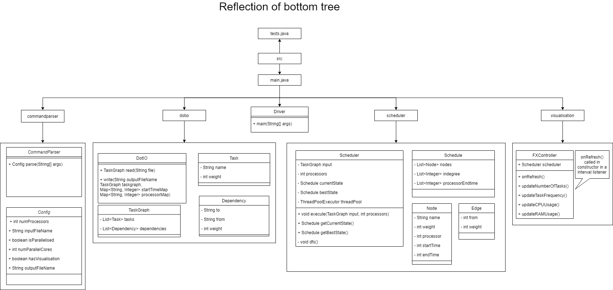

# Architecture & Class Structure

## Class Diagram

The full scheduler program is split into several components that each perform key tasks for the program. Modules are encapsulated in packages. The packages are:

- `dotiO` handles the parsing of input files, as well as the writing of the output files. Converts input .dot into a TaskGraph object and ensures that the output is valid .dot syntax.
- `commandparser` handles the parsing of the initial input command arguments. Makes sure the arguments are correct and handles faulty input commands.
- `scheduler` performs the actual DFS branch & bound search on the input graph to find an optimal schedule. Also handles the decision of which version of the algorithm to execute at runtime.
- `validitychecker` is used to check output schedules and ensure that the output is valid and meets all communication time requirements.
- `visualisation` contains all formatting/styling for the UI component, as well as components to poll and update the UI.
- `dataretriever` handles the collection of CPU and RAM data to provide to the visualisation.

## Class Diagram

This is the initial version of the class diagram that was used for development for Milestone 1:


## Main Method Pseudocode

The following pseudocode decribes how each module of the program interacts with others:

```
    Command command = CommandParser.read(args)
    TaskGraph tg = DotParser.read(command.filename)

    Scheduler sc = new Scheduler(tg)
    if (command.isVisualised) {
        FXController(sc)
    }

    sc.execute()

    DotParser.write(tg, sc.getOutput)
```
